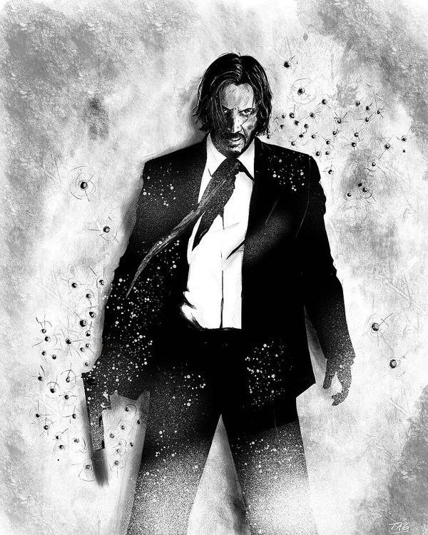
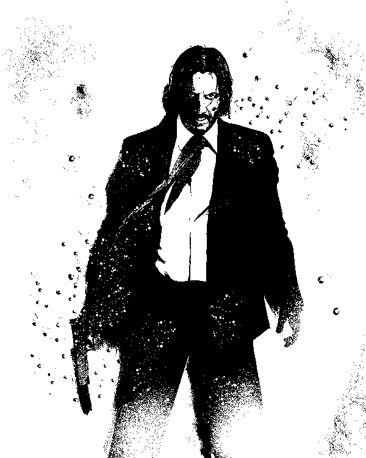
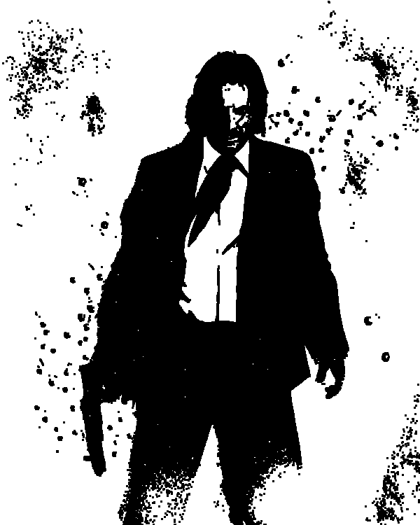
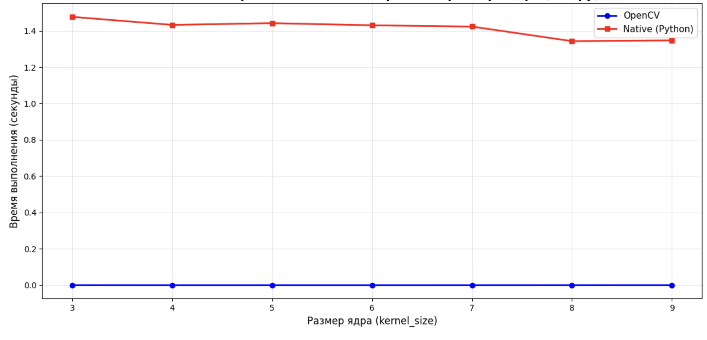
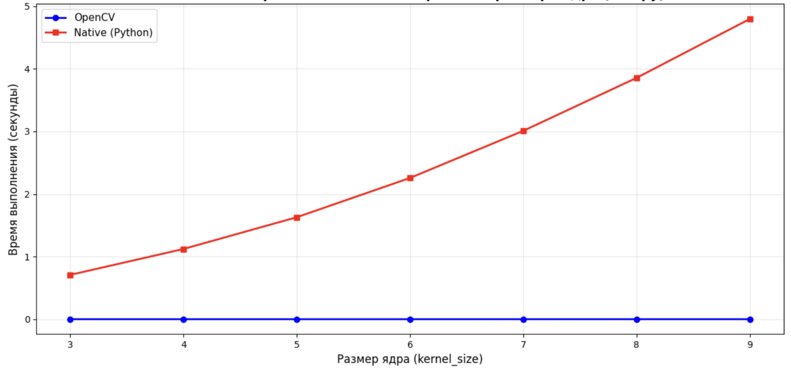

# Лабораторная работа №1

## Реализация и исследование алгоритма эрозии изображений

**Выполнили работу:** Никита Кулаков, Артём Зинатулин, Алина Мухомедьярова

### 1. Цель работы

Изучить принцип работы морфологической операции эрозии. Реализовать алгоритм обработки бинарного изображения двумя способами:

1. "Вручную" на языке Python (Native).
2. С использованием библиотечной функции OpenCV.
   Сравнить производительность обоих подходов.

### 2. Теоретическая справка

Эрозия (размывание) — базовая операция математической морфологии. Основная идея заключается в использовании структурного элемента (ядра, kernel), который перемещается по изображению.
В данной работе используется ядро размером 3x3.

Логика работы для бинарного изображения:

1. Если центр ядра совпадает с пикселем объекта (белый), мы проверяем его соседей.
2. Новое значение пикселя будет белым (1 или 255) только в том случае, если _все_ пиксели под маской ядра также являются белыми.
3. В любом другом случае пиксель становится черным (0).

Это приводит к тому, что объекты уменьшаются в размерах, а тонкие линии и одиночные шумовые пиксели исчезают.

### 3. Описание реализации

#### 3.1. Собственная реализация (Native)

Для реализации алгоритма была написана функция, использующая вложенные циклы. Функция принимает на вход двухмерный массив (бинарное изображение) и возвращает новый обработанный массив.
Мы проходим по изображению, отступая 1 пиксель от края, чтобы окно 3x3 не вышло за границы массива. Проверка условия (все ли пиксели белые) осуществляется через numpy.all.

Код функции:

```python
def erosion_native(bin_img, kernel_size):
    h, w = bin_img.shape
    out = np.zeros_like(bin_img)
    offset = kernel_size // 2
    for y in range(offset, h - offset):
        for x in range(offset, w - offset):
            window = bin_img[y-offset:y+offset+1, x-offset:x+offset+1]
            if np.all(window == 255):
                out[y, x] = 255
    return out
```

Альтернативная реализация через циклы:

```python
def erosion_native(bin_img, kernel_size):
    h, w = bin_img.shape
    out = np.zeros_like(bin_img)
    offset = kernel_size // 2
    for y in range(offset, h - offset):
        for x in range(offset, w - offset):
            s = 0
            for i in range(kernel_size):
                for j in range(kernel_size):
                    s += 1 if bin_img[y-offset+i, x-offset+j] else 0
            if s == kernel_size * kernel_size:
                out[y, x] = 255
    return out
```

#### 3.2. Библиотечная реализация

В качестве эталона использовалась функция cv2.erode из библиотеки OpenCV, которая выполняет ту же операцию, но базируется на оптимизированном C++ коде.

Код тестирования:

```python
t0 = time.time()
res_cv2 = erosion_cv2(bin_img)
t1 = time.time()
res_native = erosion_native(bin_img)
t2 = time.time()

print("OpenCV erosion:", t1 - t0, "sec")
print("Native erosion:", t2 - t1, "sec")
```

### 4. Результаты работы

#### 4.1. Визуальное сравнение

Сравнение обработанных изображений показало идентичность результатов. Мелкие детали были удалены, границы объектов сузились.

|          Исходное изображение           |            Бинаризованное изображение             |              Native (Python)               |                 OpenCV                  |
| :-------------------------------------: | :-----------------------------------------------: | :----------------------------------------: | :-------------------------------------: |
|  |  |  |  |

#### 4.2. Сравнение быстродействия

Для оценки скорости работы использовался модуль time. Замеры проводились на одном и том же изображении.

Результаты выполнения:

OpenCV erosion: 0.0005090236663818359 sec
Native erosion: 1.4559168815612793 sec

##### Сравнение производительности двух реализаций:

Реализация через матричные операции на numpy:


Реализация через циклы:


### 5. Выводы

В ходе выполнения лабораторной работы я реализовал алгоритм эрозии с нуля.

Анализ времени выполнения показал колоссальную разницу в производительности:

- Реализация на базовом Python заняла ~1.45 секунды.
- Реализация OpenCV заняла ~0.0005 секунды.

Библиотечная функция работает быстрее в тысячи раз. Это связано с тем, что интерпретатор Python медленно обрабатывает вложенные циклы for, выполняя динамическую типизацию на каждой итерации. OpenCV же использует скомпилированный код низкого уровня (C/C++) и векторизацию процессора.

Поэтому для обработки изображений в реальном времени необходимо использовать специализированные библиотеки.
